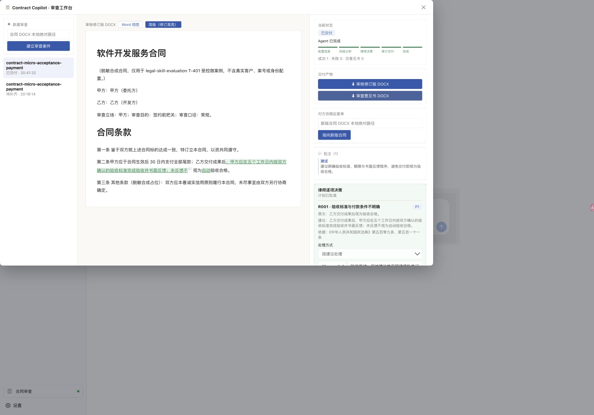

# 律师决策工作台验收

日期：2026-09-04

运行时候选：`e287ee2`（`docs: close lawyer decision workbench`；运行代码来自其父提交 `793b7ca`）

DSH 基线：`76fda72979`（Web 显示 `0.1.2-rc.1-76fda72`）

结论：通过。Contract Copilot `0.3.0` 已在真实 DSH Web 中完成“建案 → 专属 Agent 分析 → 强制等待律师 → 逐项决定与批准 → 同一 Agent 继续 → 真实 Python 修订 → finalize → 双 DOCX 交付”，并在 DSH 重启后恢复业务状态、律师决定和交付入口。

## 1. 候选绑定与检查

- `pnpm test`：13 个测试文件、103 项测试全部通过；其中 Python 集成测试真实启动 `python3` 并生成 DOCX。
- 构建：Node 类型检查、Client 类型检查和 Client bundle 均通过；`lib/client.js` 为 478.76 kB。
- `pnpm peers check`：插件开发 checkout 无 peer dependency 问题。
- dsh-plugin-lint 机械层：`0 FAIL / 0 WARN`。
- `git diff --check`：通过。
- `pnpm pack` 生成 `@yangweixin/dsh-contract-copilot@0.3.0`，候选 tarball SHA-256 为 `cfbc9487d45dd9be980148f9c86943c7f084aa9ade6f370a1ad2d301a1a503a8`。
- 候选从 tarball 安装到全新 DSH Web profile；配置层确认工作台、隔离 session 目录、本地 skill 副本和 replay provider 生效。

隔离 profile 使用 `autoInstallPeers: false`，因此 profile 目录内单独运行 `pnpm peers check` 会把由 DSH 安装回退提供的 peer 报为不可见；DSH 实际装载、Node half 和 Client half 均成功。插件开发 checkout 的完整 peer closure 已单独通过检查。

## 2. DSH 源码事实核对

- Agent 生命周期：`AgentHandle.cancel()`、`whenIdle()`、`followup()` 及 Agent registry 的 `create/resume` 来自 DSH `packages/core/agent/src/runtime-types.ts` 与 `packages/core/agent/src/index.ts`，与 Coordinator 调用一致。
- 默认模型：`agentDefaultModel.currentSelection()` 来自 `packages/core/agent-default-model/src/index.ts`，新案件没有硬编码 provider 或 model。
- UI slot：`sidebar.footer.action` 在 `packages/client/ui-sidebar/src/client/index.ts` 声明，并由该包的 sidebar 渲染组件消费；候选没有查询或改写 DSH 内部 DOM。
- Tool API：插件继续使用 `packages/core/tools/src/index.ts` 暴露的工具注册和执行接口；`exec.signal` 传入 Python bridge。
- 生命周期依赖：Agent、默认模型、LLM、session 和 tools 是硬依赖注入；Web Connection 缺失时只不注册工作台数据面，headless 工具仍可使用。

## 3. 插件契约核对

1. Lossless JSON：所有 tool 结果在返回前递归移除 `undefined`，现有回归测试覆盖该路径。
2. Schema DSL：工具 schema 保持支持的字段层级，独立 schema 字面量使用静态类型约束。
3. Client 工件：bundle 同时构造 `module/exports`，并在 ESM 包中输出 `.js`；机械检查通过。
4. Client 纯度：Client 只绑定 `dsh.client.inject` 声明的平台模块，共享协议不导入 Node API。
5. 子进程：Python bridge 使用异步 `spawn` 并接收 `exec.signal`，没有同步长任务阻塞 harness。
6. 显式参数：审查立场、目的、强度、编辑策略和 reviewer 均由 intake/session 显式传给 Python，不依赖 CLI 静默默认值。
7. Fail loud：无效配置、未批准计划、旧 plan hash 和批准后文件篡改均在 Python 启动前返回稳定错误。
8. 退码分类：partial/rejected 是领域结果，基础设施失败才抛异常；测试覆盖成功和各类失败投影。
9. 构建管线：构建先清理 `lib/`，命令不使用吞退出码的管道。
10. HMR：out-of-tree Client 工件更新后需要重启 DSH；README 与决策记录保持该限制，本次候选也按重启流程验收。

## 4. 浏览器完整链路

输入是仓库自带的脱敏合成微案例 `contract-micro-acceptance-payment.docx`。为避免合同内容离开本机，验收使用 DSH 的本地 replay provider；Python apply 使用临时 skill 副本，未改写真实 Contract Copilot 配置和 archive。

浏览器实际验证：

- 官方侧栏 `sidebar.footer.action` 显示“合同审查”，点击后打开三栏工作台。
- 建案后出现 4 个前置信息问题；自由文本问题在可访问性树中显示完整问题名称。
- 工作台直接启动案件专属 Agent；analyze 完成后状态为 `plan_ready` 和“等待律师决策”。
- R001 未决定时，“请先决定全部审查项”按钮为 disabled；选择“按建议处理”并填写内部备注后，按钮变为可用的“批准方案并生成交付物”。
- 批准后同一 Agent 调用 apply 与 finalize，业务状态依次经过 `applying`、`applied`、`delivered`。
- 最终统计为成功 1、失败 0、仅意见书 0；修订预览显示新增验收期限及书面反馈条款，同时展示批注、批准锁和两个 DOCX 下载入口。
- `planReview.history` 追加 `plan-generated` 与 `plan-approved`；R001 决定、批准人、批准时间、律师备注和相同的 source/approved hash 均落盘。
- 停止并重新启动 DSH 后，工作台恢复“已交付”、R001 决定、批准锁、修订预览、统计和两个下载入口。
- 最终候选重跑交付时先显示“Agent 已恢复，正在按获批方案重新生成交付物”；持久状态到达 `delivered` 后该临时 `role=status` 提示自动清除，不再与“Agent 已完成”冲突。
- 从 `e287ee2` 重新打包并安装后，最终 boot 无错；浏览器再次断言官方侧栏入口、工作台对话框、`delivered`、`Agent 已完成`、批准锁、空 `role=status` 和两个 DOCX 下载入口。

Ego 浏览器的 `Page.captureScreenshot` 在 Word 渲染页连续超时；证据图由同一受控浏览器标签页在最终状态下通过 `Page.printToPDF` 渲染，再转换为 1440×1008 JPEG。结构化 DOM 断言和最终 `role=status` 空值在同一任务空间单独读取。

## 5. 交付物核验

- `review-plan.json` SHA-256 为 `fc8d00009f7a67a59e3a58262efcdbc8903b9e90d3dd832b096499df99bc3498`，与 session 中的 source/approved hash 一致。
- 审核修订版约 45 kB，审查意见书约 7 kB；两份 DOCX 均通过 `unzip -t`，内部 OOXML 无压缩错误。
- session 历史包含 intake、analyze、apply 开始、apply 完成和 finalize 五次业务状态跃迁；Agent automation 最终为 `delivered`。

## 6. 验收边界

本轮没有向外部模型服务发送合同内容；Agent/LLM/tool/session 的真实 DSH 编排由本地确定性回放驱动，Python 修订和 DOCX 产出是真实执行。真实 DeepSeek provider 的内容质量与网络错误路径不在本轮授权范围内，后续如需验证，应另用明确授权的脱敏合同运行。
